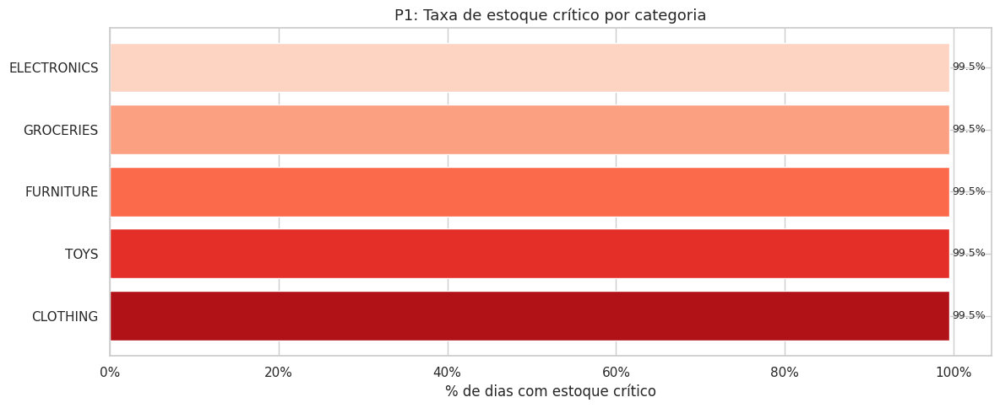
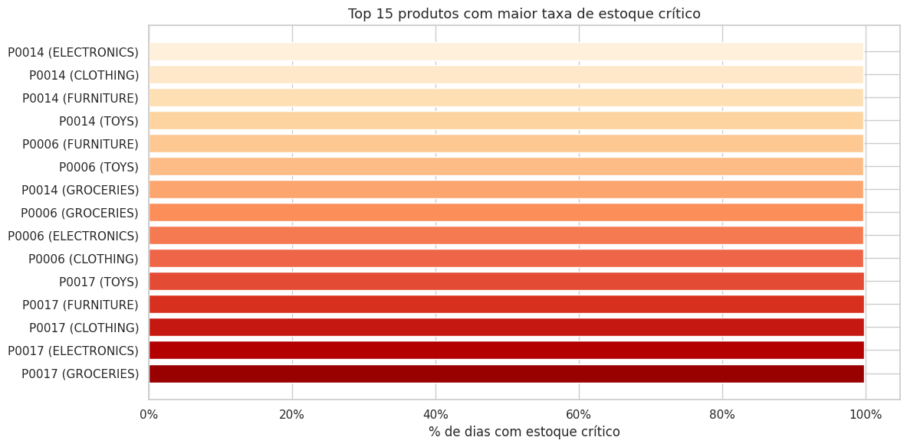
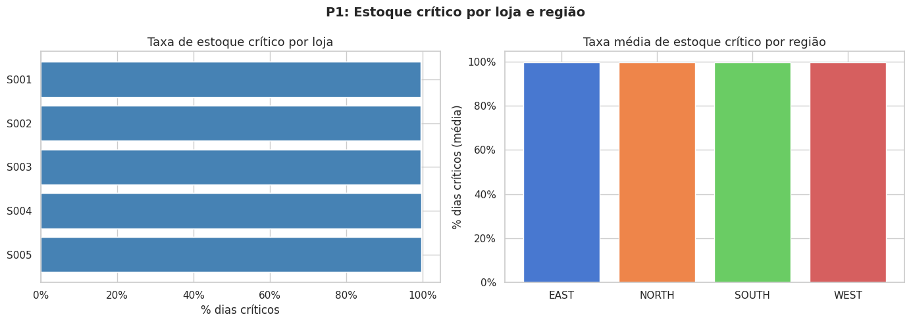
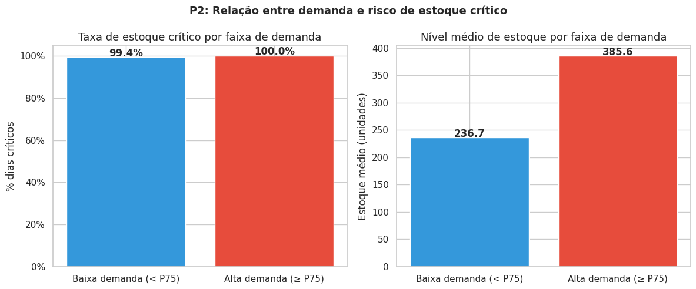
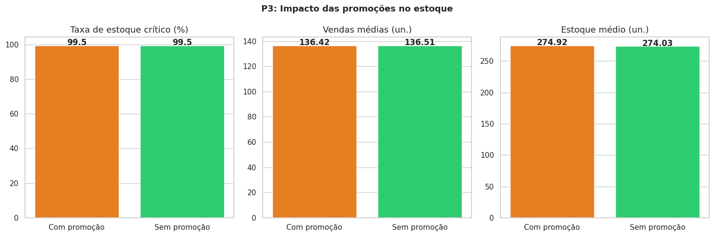
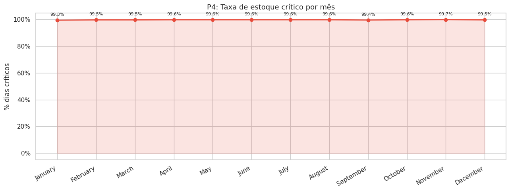
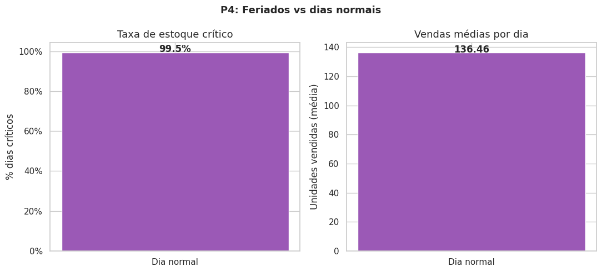
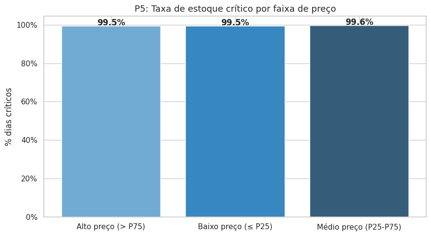

# MVP de Engenharia de Dados: Risco de Ruptura de Estoque no Varejo

**Nome:** Renata Virginia &nbsp;|&nbsp; **Matrícula:** 4052025002400  
**Plataforma:** Databricks Free Edition &nbsp;|&nbsp; **Dataset:** Retail Store Inventory Forecasting (Kaggle, CC0)

---

> **Relatório completo:**
> [`relatorio_mvp.pdf`](relatorio_mvp.pdf) &nbsp;·&nbsp;
> [`relatorio_mvp.html`](relatorio_mvp.html)
>
> **Execução do pipeline no Databricks (com outputs):**
> [`pipeline_completo.html`](https://renatavirginia.github.io/MVP_Engenharia_Dados_PUC/pipeline_completo.html)

---

## Sumário

- [1. Contexto de Negócios e Perguntas](#1-contexto-de-negócios-e-perguntas)
- [2. Carga dos Dados](#2-carga-dos-dados)
- [3. Modelagem e Catálogo de Dados](#3-modelagem-e-catálogo-de-dados)
- [4. Pipeline de Dados / ETL](#4-pipeline-de-dados--etl)
- [5. Qualidade de Dados](#5-qualidade-de-dados)
- [6. Análise de Dados](#6-análise-de-dados)
- [7. Autoavaliação](#7-autoavaliação)
- [Tecnologias](#tecnologias)

---

## 1. Contexto de Negócios e Perguntas

Uma empresa varejista precisa garantir a disponibilidade dos produtos para atender à demanda dos consumidores. A ocorrência de níveis insuficientes de estoque pode resultar em **ruptura**, perda potencial de vendas e pior experiência para o consumidor. Ao mesmo tempo, manter estoques excessivamente elevados aumenta custos e capital imobilizado.

O objetivo deste projeto é construir um pipeline de dados capaz de organizar e transformar dados históricos de vendas e estoque para **identificar padrões associados ao risco de ruptura** e gerar informações que apoiem decisões de abastecimento.

<details>
<summary><strong>Dataset</strong></summary>

- **Nome:** Retail Store Inventory Forecasting Dataset
- **Fonte:** Kaggle (Anirudh Chauhan)
- **Licença:** CC0 (Public Domain)
- **Volume:** ~73.000 registros diários
- **Conteúdo:** Informações de lojas, produtos, vendas, níveis de estoque, preços, promoções, feriados e condições climáticas

</details>

<details>
<summary><strong>Regra de negócio: Estoque Crítico</strong></summary>

O dataset não possui uma coluna explícita de ruptura. Foi criada a seguinte regra:

> **`flag_estoque_critico = True`** quando `dias_cobertura < 7`
>
> onde `dias_cobertura = nivel_estoque / demanda_media_7d`

**Justificativa:** O critério de 7 dias de cobertura é padrão de mercado para varejo de ciclo curto. Abaixo desse limiar, o estoque está em zona de risco iminente de ruptura antes do próximo ciclo de reabastecimento.

</details>

<details>
<summary><strong>Perguntas de negócio</strong></summary>

| # | Pergunta |
|---|---|
| P1 | Quais produtos, categorias e lojas têm maior frequência de estoque crítico? |
| P2 | Há relação entre alto volume de vendas e maior risco de estoque crítico? |
| P3 | Promoções aumentam a pressão sobre o estoque e geram mais eventos críticos? |
| P4 | Feriados e períodos específicos apresentam maior pressão sobre o estoque? |
| P5 | Há relação entre preço do produto e risco de estoque crítico? *(complementar)* |

</details>

---

## 2. Carga dos Dados

> Notebook: [`notebooks/01_bronze_ingestao.py`](notebooks/01_bronze_ingestao.py)

O dataset está disponível como tabela Delta gerenciada no Unity Catalog do Databricks (`workspace.default.retail_store_inventory`), carregada previamente a partir do arquivo CSV original do Kaggle.

<details>
<summary><strong>Como foi feita a carga</strong></summary>

1. Download do arquivo `retail_store_inventory.csv` do Kaggle (autor: Anirudh Chauhan, licença CC0)
2. Ingestão como tabela Delta no Unity Catalog: `workspace.default.retail_store_inventory`
3. Leitura com PySpark via `spark.table()` no notebook `01_bronze_ingestao.py`
4. Renomeação das colunas para snake_case (necessário para compatibilidade com Delta Lake)
5. Adição dos metadados `ingestion_date` e `source_table`
6. Gravação como tabela Delta na camada Bronze: **73.100 registros**

</details>

---

## 3. Modelagem e Catálogo de Dados

> Notebook: [`notebooks/03_gold_modelagem.py`](notebooks/03_gold_modelagem.py)

<details>
<summary><strong>Arquitetura Medallion</strong></summary>

```
Bronze (dado bruto)  →  Silver (limpo e padronizado)  →  Gold (modelado para análise)
inventory_raw            inventory_clean                  fato_estoque_diario
                                                          dim_produto
                                                          dim_loja
                                                          dim_data
```

</details>

<details>
<summary><strong>Esquema Estrela (camada Gold)</strong></summary>

```
                        +------------------+
                        |    dim_data      |
                        +------------------+
                        | id_data (PK)     |
                        | data_completa    |
                        | ano / mes        |
                        | trimestre        |
                        | dia_semana       |
                        | nome_mes         |
                        | feriado          |
                        +--------+---------+
                                 |
+----------------+    +----------+-------------------+    +--------------+
|  dim_produto   |    |    fato_estoque_diario        |    |  dim_loja    |
+----------------+    +------------------------------+    +--------------+
| id_produto (PK)|<---| id_produto (FK)              |    | id_loja (PK) |
| produto_id_orig|    | id_loja    (FK) ------------>|--->| loja_id_orig |
| nome_produto   |    | id_data    (FK)              |    | nome_loja    |
| categoria      |    | unidades_vendidas            |    | regiao       |
+----------------+    | nivel_estoque                |    +--------------+
                      | preco_unitario               |
                      | em_promocao / feriado        |
                      | demanda_media_7d  (calculado)|
                      | dias_cobertura    (calculado)|
                      | flag_estoque_critico (calc.) |
                      +------------------------------+
```

</details>

<details>
<summary><strong>Catálogo de Dados — bronze.inventory_raw</strong></summary>

73.100 registros. Dados ingeridos com colunas renomeadas para snake_case e metadados de controle adicionados.

| Coluna | Tipo | Descrição |
|---|---|---|
| store_id | String | Identificador da loja |
| product_id | String | Identificador do produto |
| category | String | Categoria do produto |
| region | String | Região geográfica da loja |
| date | String | Data do registro |
| inventory_level | Integer | Nível de estoque disponível |
| units_sold | Integer | Unidades vendidas no dia |
| units_ordered | Integer | Unidades pedidas/repostas no dia |
| demand_forecast | Double | Previsão de demanda |
| price | Double | Preço unitário do produto |
| discount | Double | Desconto aplicado |
| weather_condition | String | Condição climática do dia |
| holiday_promotion | String | Indicador de feriado ou promoção |
| competitor_pricing | Double | Preço do concorrente |
| seasonality | String | Estação do ano |
| ingestion_date | Timestamp | Data/hora da ingestão (metadado) |
| source_table | String | Tabela de origem no Unity Catalog (metadado) |

</details>

<details>
<summary><strong>Catálogo de Dados — silver.inventory_clean</strong></summary>

73.100 registros. Dados limpos e padronizados com nomes de colunas em português.

| Coluna | Tipo | Descrição |
|---|---|---|
| loja_id | String | Identificador da loja |
| produto_id | String | Identificador do produto |
| categoria | String | Categoria (padronizada em uppercase) |
| regiao | String | Região (padronizada em uppercase) |
| data | Date | Data do registro |
| nivel_estoque | Integer | Estoque disponível no dia |
| unidades_vendidas | Integer | Unidades vendidas no dia |
| unidades_pedidas | Integer | Unidades repostas no dia |
| previsao_demanda | Double | Previsão de demanda |
| preco_unitario | Double | Preço unitário |
| desconto | Double | Desconto aplicado |
| condicao_climatica | String | Condição climática |
| em_promocao | Boolean | Se havia promoção ativa no dia |
| feriado | Boolean | Se era feriado |
| preco_concorrente | Double | Preço do concorrente |
| sazonalidade | String | Estação do ano |

</details>

<details>
<summary><strong>Catálogo de Dados — gold (dimensões e fato)</strong></summary>

| Tabela | Registros |
|---|---|
| `dim_produto` | 100 |
| `dim_loja` | 20 |
| `dim_data` | 731 |
| `fato_estoque_diario` | 1.462.000 |

**gold.fato_estoque_diario** — colunas principais:

| Coluna | Tipo | Descrição | Linhagem |
|---|---|---|---|
| id_data | Integer | FK → dim_data | Silver: data |
| id_produto | Integer | FK → dim_produto | Silver: produto_id |
| id_loja | Integer | FK → dim_loja | Silver: loja_id |
| nivel_estoque | Integer | Estoque disponível | Silver: nivel_estoque |
| unidades_vendidas | Integer | Quantidade vendida | Silver: unidades_vendidas |
| preco_unitario | Double | Preço do produto | Silver: preco_unitario |
| em_promocao | Boolean | Se havia promoção | Silver: em_promocao |
| feriado | Boolean | Se era feriado | Silver: feriado |
| demanda_media_7d | Double | Média móvel 7d de vendas | **Calculado** via window function |
| dias_cobertura | Double | nivel_estoque / demanda_media_7d | **Calculado** |
| flag_estoque_critico | Boolean | Risco de ruptura | **Calculado**: dias_cobertura < 7 |

</details>

---

## 4. Pipeline de Dados / ETL

O pipeline foi organizado em notebooks separados por camada, seguindo a Arquitetura Medallion. Cada notebook é independente e pode ser executado isoladamente após o anterior ter sido concluído.

| Notebook | Camada | Responsabilidade |
|---|---|---|
| [`00_pipeline_completo.py`](notebooks/00_pipeline_completo.py) | Todas | Executa todas as etapas em sequência |
| [`01_bronze_ingestao.py`](notebooks/01_bronze_ingestao.py) | Bronze | Leitura da tabela de origem e gravação sem transformações |
| [`02_silver_transformacao.py`](notebooks/02_silver_transformacao.py) | Silver | Limpeza, padronização e remoção de duplicatas |
| [`03_gold_modelagem.py`](notebooks/03_gold_modelagem.py) | Gold | Criação do Esquema Estrela e aplicação da regra de ruptura |
| [`04_qualidade_dados.py`](notebooks/04_qualidade_dados.py) | Bronze / Silver / Gold | Verificação de qualidade nas três camadas |
| [`05_analise_negocio.py`](notebooks/05_analise_negocio.py) | Gold | Resposta às 5 perguntas de negócio com visualizações |

<details>
<summary><strong>Transformações realizadas (Silver →</strong> <code>02_silver_transformacao.py</code><strong>)</strong></summary>

| Transformação | Decisão |
|---|---|
| Renomeação de colunas | Nomes padronizados em português |
| Conversão de tipos | `data` → DateType, numéricos → Int/Double |
| Separação feriado/promoção | Criadas colunas booleanas `em_promocao` e `feriado` |
| Padronização de strings | Trim + uppercase em categorias e regiões |
| Duplicatas | Removidas por chave `loja_id + produto_id + data` |
| Nulos essenciais | Linhas com `nivel_estoque` ou `unidades_vendidas` nulos removidas |
| Nulos secundários | Substituídos por valor padrão (0 ou "NAO_INFORMADO") |
| Valores impossíveis | Estoque/vendas negativos e preço zero removidos |

</details>

<details>
<summary><strong>Métricas calculadas (Gold →</strong> <code>03_gold_modelagem.py</code><strong>)</strong></summary>

| Métrica | Fórmula | Ferramenta |
|---|---|---|
| `demanda_media_7d` | Média móvel de 7 dias de `unidades_vendidas` por produto+loja | PySpark Window Function |
| `dias_cobertura` | `nivel_estoque / demanda_media_7d` | PySpark |
| `flag_estoque_critico` | `dias_cobertura < 7` | PySpark |

</details>

---

## 5. Qualidade de Dados

> Notebook: [`notebooks/04_qualidade_dados.py`](notebooks/04_qualidade_dados.py)

A verificação de qualidade cobriu as três camadas (Bronze, Silver e Gold) em cinco dimensões:

| Dimensão | O que foi verificado | Resultado |
|---|---|---|
| Completude | % de nulos por coluna em todas as camadas | 0 nulos em todas as colunas |
| Unicidade | Duplicatas na chave `loja_id + produto_id + data` | 0 duplicatas |
| Consistência | Formato de datas, domínio de categorias e regiões | Sem inconsistências |
| Acurácia | Valores negativos em estoque, vendas e preço | 0 registros inválidos |
| Outliers | Percentis de estoque, vendas e dias de cobertura | Distribuição esperada |

---

## 6. Análise de Dados

> Notebook: [`notebooks/05_analise_negocio.py`](notebooks/05_analise_negocio.py)

<details>
<summary><strong>P1 — Quais produtos, categorias e lojas têm maior frequência de estoque crítico?</strong></summary>





</details>

<details>
<summary><strong>P2 — Há relação entre alto volume de vendas e maior risco de estoque crítico?</strong></summary>



</details>

<details>
<summary><strong>P3 — Promoções aumentam a pressão sobre o estoque?</strong></summary>



</details>

<details>
<summary><strong>P4 — Feriados e períodos específicos apresentam maior pressão?</strong></summary>




</details>

<details>
<summary><strong>P5 — Há relação entre preço do produto e risco de estoque crítico? (complementar)</strong></summary>



> **Ressalva:** o dataset sintético apresenta baixa variação de preços entre produtos, o que limita o poder analítico desta pergunta.

</details>

---

## 7. Autoavaliação

<details>
<summary><strong>O que foi atingido</strong></summary>

- [x] Pipeline completo Bronze → Silver → Gold implementado em notebooks separados por camada
- [x] Regra de negócio para estoque crítico definida, documentada e justificada (`dias_cobertura < 7`)
- [x] Esquema Estrela com tabela fato (`fato_estoque_diario`) e 3 dimensões (`dim_produto`, `dim_loja`, `dim_data`)
- [x] Catálogo de dados completo com tipos, descrições e linhagem
- [x] Verificação de qualidade em 5 dimensões: completude, unicidade, consistência, acurácia e outliers
- [x] 5 perguntas de negócio respondidas com análises e visualizações em Python

</details>

<details>
<summary><strong>Limitações e dificuldades</strong></summary>

- **Catálogo no Unity Catalog:** as descrições foram documentadas no README, mas não preenchidas diretamente na interface do Unity Catalog por limitação de tempo.
- **P5 (Preço x Ruptura):** dataset sintético com baixa variação de preços limita o poder analítico.
- **Compatibilidade com Delta Lake:** colunas com espaços nos nomes causaram erro `DELTA_INVALID_CHARACTERS_IN_COLUMN_NAMES` — resolvido renomeando todas para snake_case.
- **Window function com DATE:** `.cast("long")` em coluna `DATE` não é suportado na versão do Spark utilizada — resolvido com `.orderBy("data")`.
- **Coluna ambígua no join:** `fato_estoque_diario` e `dim_data` possuem ambas a coluna `feriado` — resolvido com `.drop("feriado")` na dimensão antes da junção.
- **Databricks Free Edition:** não possui publicação de notebooks com link público.

</details>

<details>
<summary><strong>Trabalhos futuros</strong></summary>

- Preencher descrições das tabelas e colunas diretamente no Unity Catalog
- Criar alertas automáticos para `dias_cobertura < 7` usando Databricks Workflows
- Explorar modelos de previsão de demanda (Prophet, ARIMA) para antecipar rupturas sazonais
- Construir dashboard interativo no Databricks SQL com atualização diária
- Ampliar a análise com dados de múltiplos períodos para detectar tendências de longo prazo

</details>

---

## Tecnologias

| Ferramenta | Uso |
|---|---|
| Databricks Free Edition | Plataforma de processamento na nuvem (Apache Spark) |
| Delta Lake | Formato de armazenamento com suporte a ACID e versionamento |
| Unity Catalog | Catálogo centralizado de dados e controle de acesso |
| PySpark | Processamento distribuído dos dados |
| Python (Pandas, Matplotlib, Seaborn) | Análise exploratória e visualizações |
| SQL | Consultas analíticas sobre as tabelas Gold |
